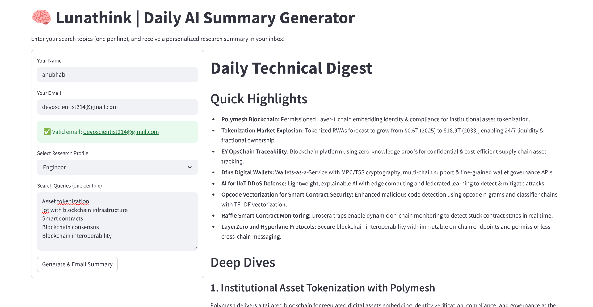

# 🌙 Lunathink — Your Personalized AI Research Assistant

**Lunathink** is an intelligent, automated assistant designed to help AI researchers and professionals stay on top of the ever-growing stream of research papers, blogs, and articles. By combining web scraping, natural language processing (NLP), and email automation, Lunathink retrieves, summarizes, and delivers curated content straight to your inbox.

---

## 🧠 Project Overview

The rapid pace of advancements in artificial intelligence makes it challenging to keep up with the latest research. Lunathink addresses this problem by:

- 🔍 Scraping AI-related content from trusted sources
- 🧠 Using large language models to summarize key insights
- 📬 Sending personalized summaries via email

Built with modularity and future scalability in mind, this project can be extended to other domains that require automated research aggregation and summarization.

---

## 📁 Project Structure

```text
Lunathink/
├── prompts/                                 # 🧩 Curated prompts for different personas
│   ├── Business/                            # Prompts tailored for business users
│   │   ├── email_template.md
│   │   ├── relevance_check.md
│   │   ├── reviewer.md
│   │   ├── summarise_markdown_page.md
│   │   └── summariser.md
│   ├── Engineer/                            # Prompts tailored for engineers
│   │   ├── email_template.md
│   │   ├── relevance_check.md
│   │   ├── reviewer.md
│   │   ├── summarise_markdown_page.md
│   │   └── summariser.md
│   └── Researcher/                          # Prompts tailored for researchers
│       ├── email_template.md
│       ├── relevance_check.md
│       ├── reviewer.md
│       ├── summarise_markdown_page.md
│       └── summariser.md
├── screenshots/                             
│   └── Screenshot From 2025-04-15.png       # 📸 UI screenshot example
├── src/                                     # 🧪 Core code for scraping/summarizing pipeline
│   ├── development.ipynb                    # Early experimentation and prototype work
│   └── pipeline.py                          # Refactored main pipeline for scraping + summarizing
├── streamlit_app.py                         # 🚀 Streamlit interface for user interaction
├── requirements.txt                         # 📦 List of required Python packages
├── .env                                     # 🔐 API keys and email settings (not committed to version control)
└── README.md                                # 📘 Project documentation
```

---

## ⚙️ Key Features

- ✅ **End-to-End Automation**: From scraping to email delivery
- ✨ **NLP-Powered Summarization**: Uses LLMs to extract key points
- 📂 **Markdown Output**: Stores raw and summarized content for transparency and reuse
- 📨 **Email Delivery**: Automatically sends summaries to your inbox
- 🔁 **Automation-Ready**: Easily schedule with cron for regular updates

---

## 🚀 Getting Started

### 1. Clone the Repository
```bash
git clone https://github.com/DevoScientist/LunaThink.git
cd LunaThink
```

### 2. Install Dependencies
```bash
python -m venv venv
source venv/bin/activate  # On Windows: venv\\Scripts\\activate

pip install -r requirement.txt
```

### 3. Set Up Environment Variables

Create a `.env` file inside the `/` directory with the following variables:

```
OPENAI_API_KEY=your_openai_api_key
SCRAPING_API_KEY=your_scraping_api_key(we used scraping-fish, you can check them out)
SENDINGBLUE_API_KEY=your_sendingblue_api_key
SERPER_API_KEY=your_serper_api_key
```

> 🔐 **Tip:** Never commit your `.env` file to version control. Add it to your `.gitignore`.

### 4. Run the Streamlit App

From the `/` directory, run:

```bash
streamlit run streamlit_app.py
```

This will start the full pipeline: scrape → summarize → email.



---

## 🛠 Future Plans

- ⏱️ Schedule automated runs with cron or a task scheduler
- 🗃 Support multiple content domains beyond AI
- 📊 Add usage analytics and logging

---

## 🤝 Contributing

Contributions are welcome! If you spot a bug or have an idea for improvement, feel free to open an issue or submit a pull request.

---

## 💡 Inspiration

Lunathink was built to minimize information overload and give researchers more time to think deeply by automating repetitive information-gathering tasks.

---~~
